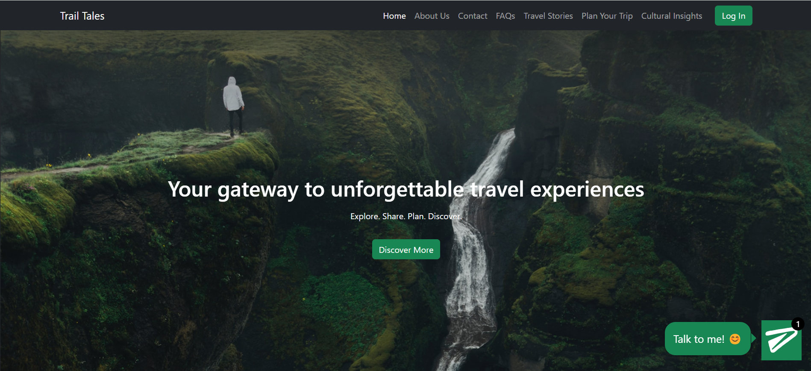
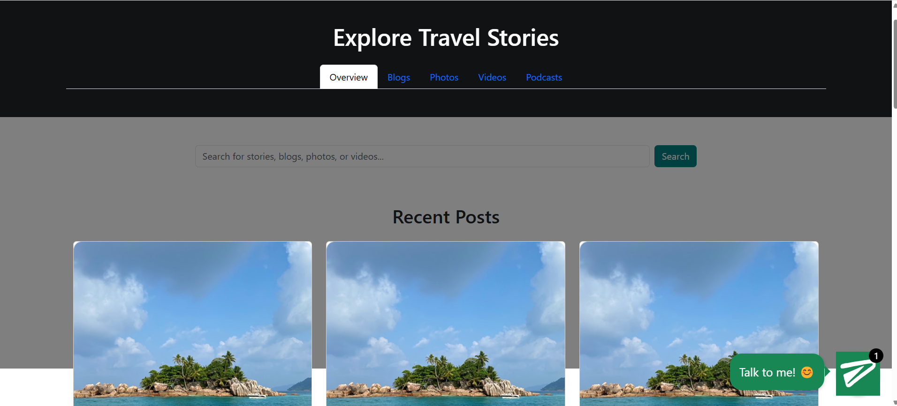
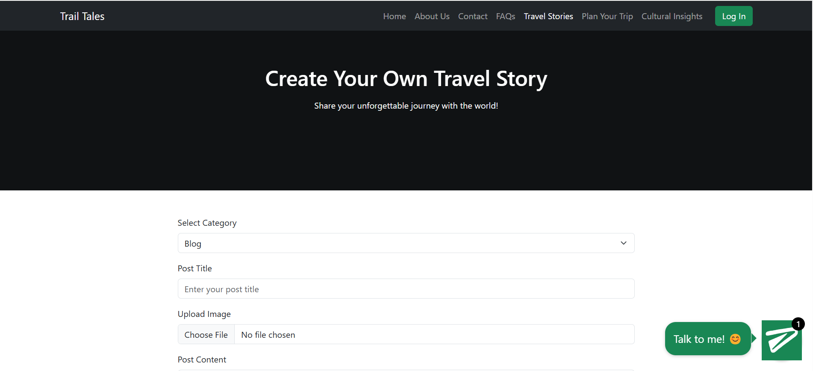
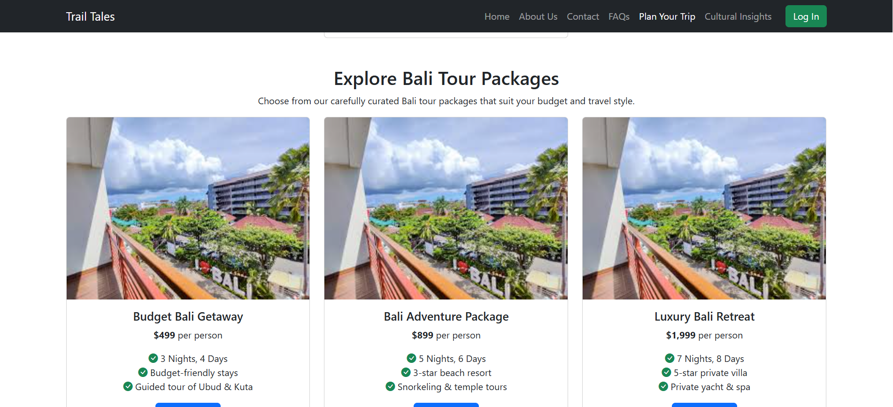
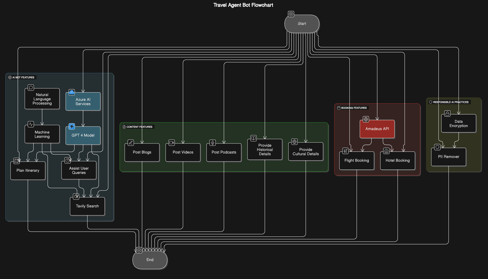

# WanderWise Travel Agent AI Bot

## Overview

The WanderWise Travel Agent AI Bot is an intelligent travel assistant designed to help users plan flexible itineraries, get real-time travel assistance, and explore travel stories through blogs, videos, and podcasts. It also provides historical and cultural insights about various destinations.

The bot leverages _Azure OpenAI (GPT-4)_ for conversational AI, _Amadeus API_ for flight and hotel bookings, and _Tavily Search_ for retrieving external information. Responsible AI practices are ensured through _PII removal and other guardrails_.

## Features

- _AI Itinerary Planner_: Generates flexible travel plans based on user preferences.
- _AI Travel Assistant_: Answers user queries about destinations, flights, hotels, and more.
- _Content Sharing Platform_: Users can post blogs, videos, and podcasts to share travel experiences.
- _Historical & Cultural Insights_: Provides informative details about destinations.
- _Secure AI Practices_: Implements PII removal and other safety measures.
- _External Search Support_: Uses Tavily Search to enhance response quality.

## Tech Stack

- _Frontend: HTML, CSS, JavaScript, Bootstrap_
- Backend: Flask, Python
- Database: SQLite
- Authentication & Storage: Firebase
- _APIs_:
  - _Amadeus API_ (Flight & Hotel Booking)
  - _Tavily Search API_ (External Query Resolution)
- _Security_: PII Removal and Guardrails for Responsible AI

## Installation

### Prerequisites

- Python 3.8+
- Node.js & npm (for frontend)
- PostgreSQL / MongoDB (for database)
- Azure OpenAI API key
- Amadeus API credentials
- Tavily API key

### Setup Instructions

1. Clone the repository:
   ```sh
   git clone https://github.com/erum-meraj/WanderWise
   cd WanderWise
   ```
2. Create and activate a virtual environment:
   ```sh
   python -m venv venv
   source venv/bin/activate  # On Windows use `venv\Scripts\activate`
   ```
3. Install dependencies:
   ```sh
   pip install -r requirements.txt
   ```
4. Configure Firebase authentication:
   - Place your Firebase Admin SDK JSON file in the root directory.
   - Update `FIREBASE_WEB_API_KEY` in `app.py`.
5. Initialize the database:
   ```sh
   flask db upgrade  # Ensure tables are created
   ```
6. Run the application:
   ```sh
   python app.py
   ```
7. Access the application at `http://127.0.0.1:5000/`.

## Screenshots

| Feature        | Screenshot                           |
| -------------- | ------------------------------------ |
| Homepage       |       |
| Travel Stories |      |
| Create Post    |    |
| Trip Planning  |  |

## Travel Bot Flowchart



## Contribution

Contributions are welcome! Follow these steps:

1. Fork the repository.
2. Create a new branch: `git checkout -b feature-branch`.
3. Commit your changes: `git commit -m "Added a new feature"`.
4. Push to the branch: `git push origin feature-branch`.
5. Open a pull request.

## License

This project is licensed under the MIT License.
